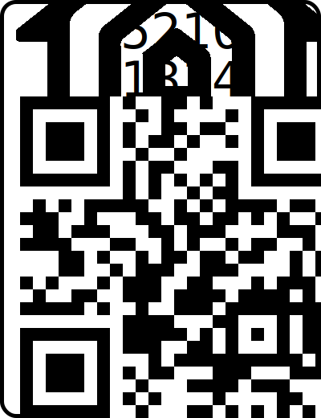

# Language

- ENG [English](README.md)
- CHS [简体中文](README_CHS.md)

---

# Native Homekit-ESP01/01s Relay

## Overview

ESP01-Homekit-Switch is an open-source project that allows you to turn an ESP8266 module (such as ESP01 or ESP8266-01S) into a smart home automation switch device that can connect to Apple Homekit.

## Quick Start

### Prerequisites

- Make sure you have Git installed.
- Install Python and the necessary library `esptool`.
- Set up the environment for compilation, recommended to use `esp-open-sdk`.
- If not compiling on the host machine, use `Docker`.

### Clone the Project

```bash
git clone https://github.com/TaylorLottner/esp01-homekit-switch.git
```

### Compile the Firmware

#### Host Machine Make Method

Set up the SDK environment:  
For details, see:[esp-open-sdk](https://github.com/pfalcon/esp-open-sdk)

```bash
cd esp01-homekit-switch
make -C devices/switch all
```

#### Docker Method

1. **Set Up Docker Environment**  
   Using a Docker container can simplify the environment setup process.

   ```bash
   docker run -itd --name esp -v /opt/esp01-homekit-switch:/opt/esp01-homekit-switch jedie/esp-open-sdk:latest /bin/bash
   ```

2. **Enter the Container**  
   Enter the Docker container to execute the compilation commands.

   ```bash
   docker exec -it esp /bin/bash
   ```

3. **Compile the Project**  
   Navigate to the root directory of the project within the container and start the compilation.
   ```bash
   cd /opt/esp01-homekit-switch
   make -C devices/switch all
   ```

After compilation, the switch.bin file will be generated in the /devices/switch/firmware directory.

### Flash the Firmware

1. **Install esptool**  
   If you haven't installed esptool yet, install it via pip.

   ```bash
   pip install esptool
   ```

2. **Prepare Firmware Files**  
   Ensure the /devices/switch/firmware directory contains the rboot.bin, blank_config.bin, and switch.bin files.

3. **Erase Flash**  
   Use esptool to clear the old firmware from the device.

   ```bash
   esptool -p [端口] erase_flash
   ```

4. **Flash New Firmware**  
   Use esptool to flash the new firmware onto the device.
   ```bash
   esptool -p [端口] -b 115200 write_flash -fs 1MB -fm dout -ff 40m 0x0 rboot.bin 0x1000 blank_config.bin 0x2000 switch.bin
   ```

### Connect to HomeKit

- **Scan QR Code**  
  Connect the device to HomeKit by scanning the provided QR code.
  

- **Manual Input**  
  If you cannot scan the QR code, you can manually add the device with the following steps:  
  1. Connect to the device's hotspot H.A.N-XXXXXXX.  
  2. Open the “Home” app on your iPhone.  
  3. Tap the + icon in the upper right corner and select “Add or Scan Accessory”.  
  4. Choose “I Don’t Have a Code or Cannot Scan” option.  
  5. Select the appropriate accessory and enter the pairing code 52101314.  

Special thanks to[LeeLulin/esp-homekit-direct](https://github.com/LeeLulin/esp-homekit-direct)
